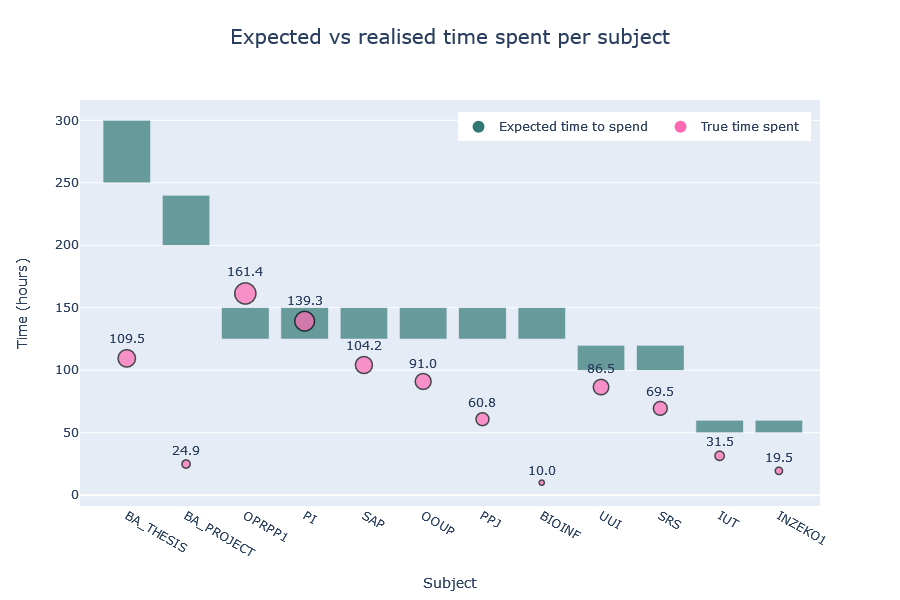

# study-hours

This dashboard consists of a collection of interactive visualisations based on the personal study data collected during
the academic year 2020/2021.

The entire dashboard has been implemented using Python, Plotly and Dash.

## Subjects

The school year included 12 different subjects, each identified by a code.
The table below explains what each code represents.

### Winter semester

| Code       | Subject (English)                         | Subject (Croatian)                              |
|------------|-------------------------------------------|-------------------------------------------------|
| PPJ        | Programming Language Translation          | Prevođenje programskih jezika                   |
| PI         | Software Engineering                      | Programsko inženjerstvo                         |
| BA_PROJECT | Bachelor Project                          | Projekt R                                       |
| SAP        | Statistical Data Analysis                 | Statistička analiza podataka                    |
| OPRPP1     | Selected Topics in Software Development 1 | Odabrana poglavlja razvoja programske potpore 1 |
| INZEKO1    | Engineering Economics 1                   | Inženjerska ekonomika 1                         |

### Summer semester

| Code      | Subject (English)                       | Subject (Croatian)                   |
|-----------|-----------------------------------------|--------------------------------------|
| SRS       | Computer Security                       | Sigurnost računalnih sustava         |
| UUI       | Introduction to Artificial Intelligence | Uvod u umjetnu inteligenciju         |
| BA_THESIS | Bachelor Thesis                         | Završni rad                          |
| BIOINF1   | Bioinformatics 1                        | Bioinformatika 1                     |
| OOUP      | Design Patterns                         | Oblikovni obrasci u programiranju    |
| IUT       | Innovation and Technology Management    | Inovacije i upravljanje tehnologijom |

## Examples

Below are the data visualisations that comprise this dashboard.

### Time spent per subject
The first visualisation is a simple bar chart comparing the total time spent on each
subject.

### Expected versus realised time spent per subject
Each subject is attributed a specific number of ECTS points, roughly indicating the anticipated hours a student
should dedicate to it for passing. The following visualisation illustrate the actual time invested in each subject
compared to the projected time derived from the ECTS points.

### Activity pie
The activity pie chart illustrates the breakdown of activities for individual subjects.
Below is an example depicting the activity pie for OPRPP1.

### Academic heatmap calendar
The academic calendar is a heatmap highlighting days characterised by varying levels of academic activities,
ranging from high to low.

